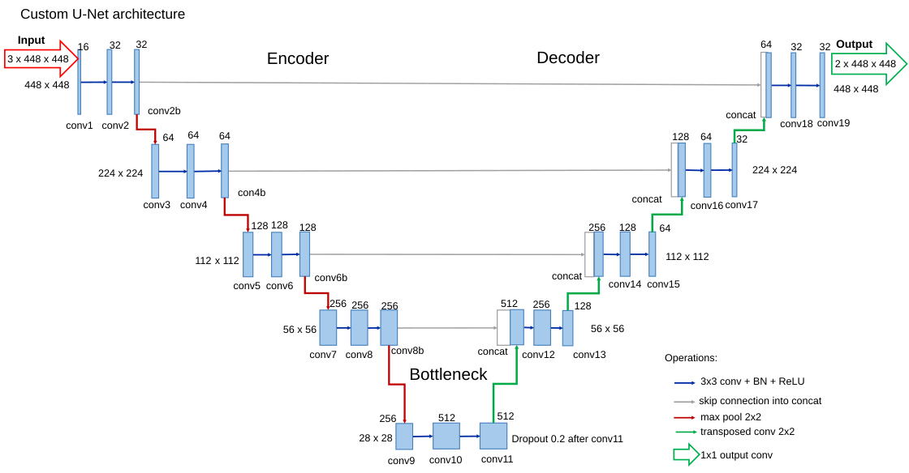
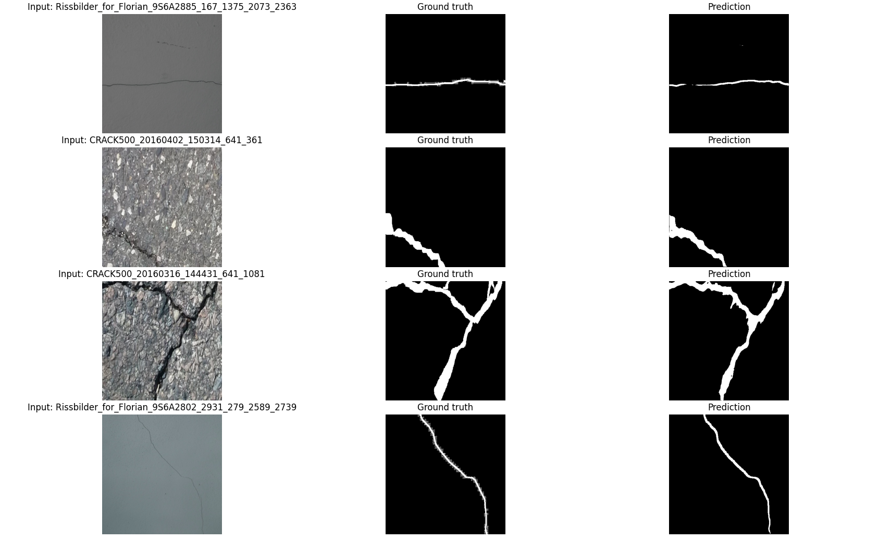

# Crack Segmentation Training

This folder contains a U-Net-based crack segmentation pipeline.

Run all commands from inside Training/Crack_Segmentation, so the relative paths work correctly.

## Files

main.py: trains the U-Net model using paired crack images and masks.

model.py: defines the U-Net segmentation model.

transform_into_C#Unity.py: final step that converts the trained U-Net checkpoint into C# weight arrays compatible with the C#-Unity platform for AR headset deployment.

dataset.py, metrics.py, evaluation.py: support files for dataset loading, metrics, and evaluation.

## Dataset

This project uses the [Concrete Crack Conglomerate Dataset](https://www.kaggle.com/datasets/aravindnagarajan/crack-segmentation-dataset/data), created by Eric Bianchi and Matthew Hebdon at Virginia Tech. The original dataset combines several public concrete-crack datasets, including CFD, Crack500, CrackTree200, DeepCrack, GAPs, Rissbilder, non-crack images, and Volker.

The dataset itself is not included in this repository.

| Split    | Images | Ground-truth masks |
| -------- | -----: | -----------------: |
| Training |  9,063 |              9,063 |
| Testing  |  1,619 |              1,619 |

Expected local structure:

```text
dataset/
├── train_images/
├── train_masks/
├── test_images/
└── test_masks/
```

Each image and its corresponding mask must have the same filename stem. Images are resized to `448 × 448` pixels before being passed to the U-Net.

## Train

python main.py --image-dir dataset/train_images --mask-dir dataset/train_masks --save-dir checkpoints --device cpu

## Export C# weights

python transform_into_C#Unity.py --checkpoint-path checkpoints/fold_1/best_model.pth --output-dir csharp_export

## Model architecture

The model uses a U-Net architecture for binary crack segmentation.

- Input: RGB image, `3 × 448 × 448`
- Output: binary crack mask, `1 × 448 × 448`
- Encoder: convolution blocks with max pooling
- Decoder: transposed convolutions with skip connections
- Final layer: `1 × 1` convolution



## Example results

The figure below shows four test examples with the input image, ground-truth mask, and predicted crack mask.



## Evaluate

```bash
python evaluation.py \
  --test-image-dir dataset/test_images \
  --test-mask-dir dataset/test_masks \
  --checkpoint-path checkpoints/fold_1/best_model.pth \
  --device cpu

## Model performance

> Placeholder values for README formatting. Replace with actual results after retraining.

| Metric    | Score |
| --------- | ----: |
| F1 Score  | 0.642 |
| Recall    | 0.579 |
| Precision | 0.635 |
| mIoU      | 0.709 |

Use these only as temporary placeholder values until you replace them with the actual retraining results.


Best trained model: `best_model/best_model.pth`
