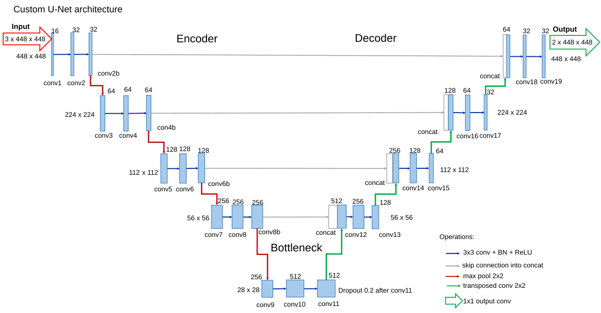
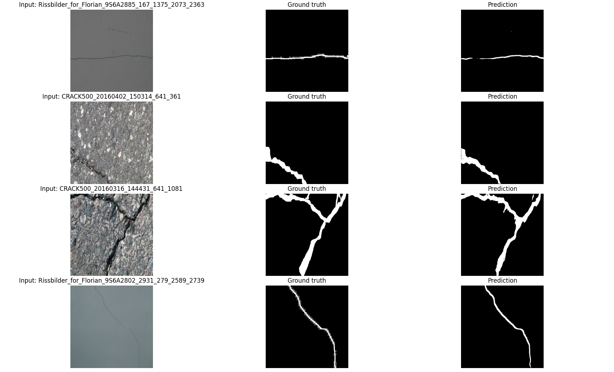

# Crack Segmentation Training

This folder contains a U-Net-based crack segmentation pipeline.

Run all commands from inside `Training/Crack_Segmentation`, so the relative paths work correctly.

## Files

`main.py`: trains the U-Net model using paired crack images and masks.

`model.py`: defines the U-Net segmentation model.

`transform_into_C#Unity.py`: final step that converts the trained U-Net checkpoint into C# weight arrays compatible with the C#-Unity platform for AR headset deployment.

`dataset.py`, `metrics.py`, `evaluation.py`: support files for dataset loading, metrics, and evaluation.

## Dataset

This project uses the [Concrete Crack Conglomerate Dataset](https://www.kaggle.com/datasets/aravindnagarajan/crack-segmentation-dataset/data), created by Eric Bianchi and Matthew Hebdon at Virginia Tech. The original dataset combines several public concrete-crack datasets, including CFD, Crack500, CrackTree200, DeepCrack, GAPs, Rissbilder, non-crack images, and Volker.

The dataset itself is not included in this repository.

| Split    | Images | Ground-truth masks |
| -------- | -----: | -----------------: |
| Training |  9,063 |              9,063 |
| Testing  |  1,619 |              1,619 |

Expected local structure:

```text
dataset/
├── train_images/
├── train_masks/
├── test_images/
└── test_masks/
```

Each image and its corresponding mask must have the same filename stem. Images are resized to `448 × 448` pixels before being passed to the U-Net.

## Train

```bash
python main.py \
  --image-dir dataset/train_images \
  --mask-dir dataset/train_masks \
  --save-dir checkpoints \
  --batch-size 8 \
  --max-epochs 50 \
  --num-folds 5 \
  --patience 10 \
  --device cpu
```

Training uses 5-fold cross-validation. The best model for each fold is saved based on validation F1 score. Early stopping stops training for a fold after 10 consecutive epochs without improvement in validation F1.

During validation, thresholds from `0.10` to `0.90` in steps of `0.05` are evaluated. The threshold with the highest validation F1 is stored with the best checkpoint.

A `last_checkpoint.pth` file is saved after each epoch so interrupted training can be resumed using the same command with:

```bash
--resume
```

## Export C# weights

```bash
python transform_into_C#Unity.py \
  --checkpoint-path checkpoints/fold_1/best_model.pth \
  --output-dir csharp_export
```

## Model architecture

The model uses a U-Net architecture for binary crack segmentation.

* Input: RGB image, `3 × 448 × 448`
* Output: binary crack mask, `1 × 448 × 448`
* Encoder: convolution blocks with max pooling
* Decoder: transposed convolutions with skip connections
* Final layer: `1 × 1` convolution



## Example results

The figure below shows four test examples with the input image, ground-truth mask, and predicted crack mask.



## Evaluate

The best Fold 1 checkpoint uses a validation-selected threshold of `0.30`.

```bash
python evaluation.py \
  --test-image-dir dataset/test_images \
  --test-mask-dir dataset/test_masks \
  --checkpoint-path checkpoints/fold_1/best_model.pth \
  --threshold 0.30 \
  --device cpu
```

## Model performance

The U-Net model was evaluated across four folds. For each fold, the probability threshold was selected using the validation set and then applied to the corresponding test set.

| Fold | Threshold | Precision | Recall | F1-score | mIoU |
|---|---:|---:|---:|---:|---:|
| Fold 1 | 0.30 | 60.67% | 71.00% | 70.30% | 74.14% |
| Fold 2 | 0.35 | 61.23% | 70.71% | 70.46% | 74.29% |
| Fold 3 | 0.35 | 63.68% | 68.29% | 70.66% | 74.55% |
| Fold 4 | 0.35 | 62.38% | 70.35% | 70.88% | 74.58% |
| **Average** |  | **61.99%** | **70.09%** | **70.58%** | **74.39%** |

### Comparison with published models

The table below provides context against published crack-segmentation models evaluated on the same dataset. Because data splits and evaluation procedures differ across studies, these values should be treated as a reference comparison rather than a controlled benchmark.

| Model | Precision | Recall | F1-score | Reference |
|---|---:|---:|---:|---|
| **U-Net (this work, 4-fold average)** | 61.99% | **70.09%**| **70.58%** | This work |
| Lee et al. U-Net (mean of 4 reported runs) | 32.18% | 62.03% | 39.98% | Lee et al., *Applied Sciences*, 2023, 13(4), 2367. [DOI](https://doi.org/10.3390/app13042367) |
| Dmg2Former (112×112) | **72.19%** | 68.86% | 70.49% | Eltouny et al., *Sensors*, 2024, 24(18), 6007. [DOI](https://doi.org/10.3390/s24186007) |
| Dmg2Former-NN (112→224) | 70.18% | 68.41% | 69.29% | Eltouny et al., *Sensors*, 2024, 24(18), 6007. |
| Dmg2Former-NN (112→448) | 69.26% | 67.18% | 68.20% | Eltouny et al., *Sensors*, 2024, 24(18), 6007. |

The Dmg2Former values correspond to the reported average crack-segmentation test metrics grouped by output image size using randomly initialized models without pretrained weights. The Lee et al. U-Net values are the arithmetic mean of the four U-Net runs reported in their Table 1.
Best Fold # checkpoint saved during training: `checkpoints/fold_#/best_model.pth`

Representative Fold 1 model manually selected and included in the repository: `best_model/best_model.pth`. The remaining fold models are omitted because they exceed GitHub’s file-size limit and produced very similar test performance.
